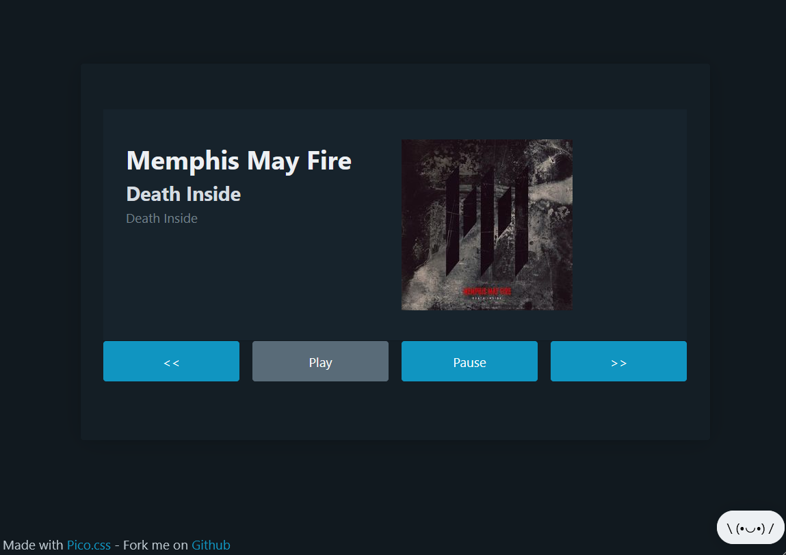

# RPI Deezer web controller
Light web app used to remote control a Raspberry playing deezer through a web browser.  



Since my Raspberry Pi is plugged to my sound system and not specifically to a screen, I needed a simple way to control my music flow though a web page. This is exactly what this project is about. 

Please note that it's made to work with Deezer, but the buttons are also working with standard media players. (Youtube, Twitch...) Although, you will miss the picture and title of the media played. 

## Why is it cool ?
- Light and Dark theme
- 8kb project
- Lightweight cdn css library
- No fancy nodejs or php Composer needed

## What you need
- `php`, obviously
- `playerctl` if not already installed on your Raspberry
- `amixer`  if not already installed on your Raspberry

I recommend using the deezer custom desktop build by **siphomateke**. [siphomateke/deezer](https://github.com/siphomateke/deezer)

## How to run
```
git clone https://github.com/ThibautPlg/RPI-web-controller.git
cd RPI-web-controller

nohup php -S 0.0.0.0:9999 &> /dev/null &
```
The interface is reachable through {your-rpi-ip}:9999
> You can change the port, but you should never use "sudo" to run the php server, as it will lost the correct environment to run the media commands.

You can also run this simple `index.php` on a nginx or an apache server.

## How to stop
```
pkill php
```
